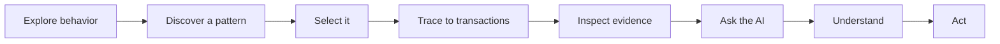
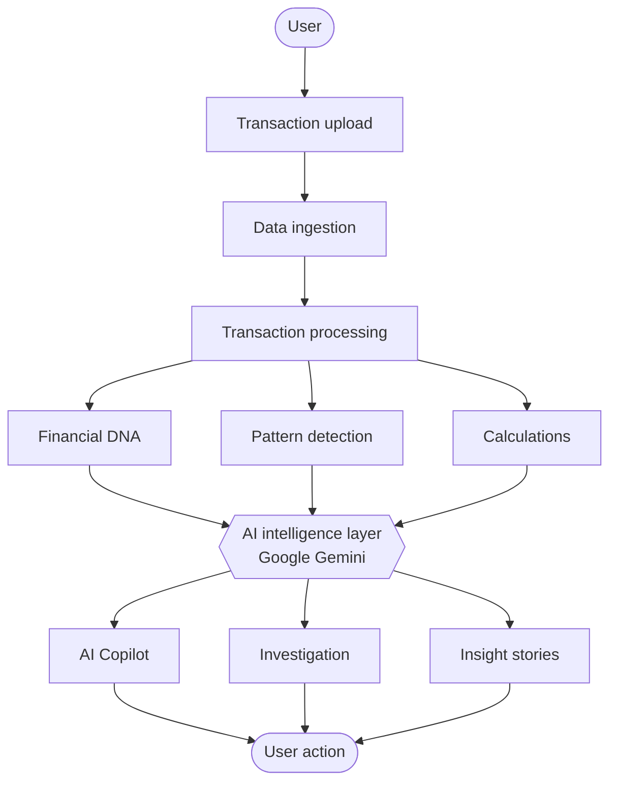

<div align="center">

# 🧠 FinGuard AI

### Your financial data, turned into financial intelligence.

**SEE → UNDERSTAND → ASK → INVESTIGATE → ACT**

An AI-powered experience that turns raw transaction history into behavioral patterns, evidence-backed insights, and decisions you can act on.

<br />

[](https://vvvvvv-ten-mu.vercel.app/)
[](https://github.com/kakashsunny/Frontend)


</div>

---

## Table of contents

- [The problem](#-the-problem)
- [The idea](#-the-idea)
- [Features](#-features)
- [Financial DNA](#-financial-dna)
- [How it works](#-how-it-works)
- [Trust and transparency](#-trust-and-transparency)
- [Tech stack](#-tech-stack)
- [Quick start](#-quick-start)
- [Configuration](#-configuration)
- [Deployment](#-deployment)
- [Try it in 60 seconds](#-try-it-in-60-seconds)
- [Accessibility and responsiveness](#-accessibility-and-responsiveness)
- [Roadmap](#-roadmap)
- [Contributing](#-contributing)

---

## 🎯 The problem

A few hundred transactions contain a detailed record of how you live: what you buy, when, where, how you pay, and what keeps repeating. But a raw list of rows hides all of it.

Traditional finance dashboards answer one question:

> *"How much did I spend?"*

FinGuard AI is built to answer the harder ones:

| Question | What FinGuard AI does |
| --- | --- |
| Where is my money actually going? | Maps spending across categories, time, and payment behavior |
| What changed in my behavior? | Surfaces shifts and repeated patterns |
| Which patterns deserve attention? | Flags unusual activity as signals worth checking |
| Why is this happening? | Explains patterns in plain language |
| What's the proof? | Traces every insight back to the transactions behind it |
| What should I do next? | Closes the loop with a suggested action |

---

## 💡 The idea

```text
RAW TRANSACTIONS → BEHAVIORAL PATTERNS → FINANCIAL DNA → EVIDENCE → AI EXPLANATION → ACTION
```

Instead of another static dashboard, FinGuard AI wraps your transaction history in an **interactive intelligence layer**. You don't just read numbers. You explore them, question them, and follow them down to the individual transaction.

---

## ⭐ Features

| | Feature | What it does |
| --- | --- | --- |
| 📂 | **Transaction upload** | Import your own transaction dataset |
| 🤖 | **AI Financial Scan** | A visible, step-by-step analysis from raw data to insights |
| 🧬 | **Financial DNA** | Interactive behavioral visualization of your financial activity |
| 💬 | **AI Copilot** | Ask questions about your data in natural language |
| 🔎 | **Transaction investigation** | Inspect any transaction with its surrounding context |
| 📖 | **Insight Story Mode** | Walk through a pattern: Pattern → Evidence → Explanation → Action |
| 📊 | **Spending intelligence** | Income vs. expenses, categories, time-based and recurring behavior |
| 📱 | **Responsive design** | Built for desktop and mobile |
| ♿ | **Accessibility-minded UI** | Keyboard interaction, focus states, semantic regions |

---

## 🧬 Financial DNA

**Financial DNA is the signature experience of FinGuard AI.**

Rather than showing activity only as rows and conventional charts, your transactions become an interactive behavioral visualization you can explore across:

- Spending categories
- Time
- Transaction activity
- Payment behavior
- Repeated patterns
- Unusual activity

You move from the big picture down to a single transaction, and back up again:



---

## ⚙️ How it works

### 1. AI Financial Scan

When you upload data, the scan makes the transformation visible instead of hiding it behind a spinner:

```text
IMPORTING DATA → MAPPING BEHAVIOR → DETECTING PATTERNS → UNDERSTANDING CONTEXT → GENERATING INSIGHTS
```

### 2. The five-step workflow

| Step | Purpose | What you can do |
| --- | --- | --- |
| **👁️ SEE** | Overview | Explore spending distribution, income vs. expenses, categories, time patterns, and recurring behavior |
| **🧠 UNDERSTAND** | Meaning | See patterns linked directly to the transactions that produced them (**Pattern → Evidence**) |
| **💬 ASK** | Exploration | Query your data conversationally with the AI Copilot |
| **🔎 INVESTIGATE** | Verification | Examine a transaction's amount, date, merchant, category, payment mode, and similar activity |
| **✅ ACT** | Decision | Turn what you learned into a concrete next step |

### 3. Ask the Copilot

The Copilot is an exploration layer over your actual data. Try:

- *"Where is my money going?"*
- *"What changed recently?"*
- *"Find unusual spending."*
- *"Show my biggest recurring expense."*
- *"Explain this pattern."*
- *"Which transactions should I investigate?"*

### 4. Insight Story Mode

Any discovered pattern can become a guided story:

```text
PATTERN → EVIDENCE → EXPLANATION → ACTION
```

So you understand not just *what* happened, but *why the data says so* and *what to do about it*.

### Architecture



---

## 🔐 Trust and transparency

Financial intelligence is only useful if you can tell *where each claim comes from*. FinGuard AI keeps four kinds of information distinct:

| Layer | Meaning | Examples |
| --- | --- | --- |
| **Source data** | Exactly what is in your uploaded dataset | Merchant, amount, date, category, payment mode, dataset-provided labels |
| **Calculated data** | Values computed from source transactions | Category totals, transaction counts, income vs. expenses, time distributions |
| **AI interpretation** | Natural-language explanation from the available context | "Your weekend spending is concentrated in dining." |
| **Investigation signals** | Patterns that may deserve a closer look | Unusual amounts, unexpected repetition |

```text
DATA → CALCULATION → AI INTERPRETATION → USER ACTION
```

**Design principles**

- **Signals, not verdicts.** An unusual transaction is labeled *Unusual Pattern* or *Needs Verification*. It is never automatically declared fraud.
- **Evidence first.** Every insight should be traceable to real transaction records.
- **Real data only.** The app analyzes the records you upload rather than inventing statistics.
- **Humans decide.** AI explains and suggests. You choose what to do.

---

## 🛠️ Tech stack

| Layer | Technology |
| --- | --- |
| **Framework** | [React 19](https://react.dev/) |
| **Language** | [TypeScript](https://www.typescriptlang.org/) |
| **Build tool** | [Vite](https://vite.dev/) |
| **Styling** | [Tailwind CSS 4](https://tailwindcss.com/) |
| **Animation** | [Motion](https://motion.dev/) |
| **Icons** | [Lucide React](https://lucide.dev/) |
| **AI** | [Google Gemini](https://ai.google.dev/) via `@google/genai` |
| **Server utilities** | Express, dotenv |
| **Hosting** | [Vercel](https://vercel.com/) |

---

## 🚀 Quick start

**Prerequisites:** [Node.js](https://nodejs.org/) (a current LTS release is recommended) and a [Gemini API key](https://aistudio.google.com/apikey).

```bash
# 1. Clone
git clone https://github.com/kakashsunny/Frontend.git
cd Frontend

# 2. Install dependencies
npm install

# 3. Configure environment (see next section)
cp .env.example .env

# 4. Start the dev server
npm run dev
```

The app runs at **http://localhost:3000**.

### Scripts

| Command | Description |
| --- | --- |
| `npm run dev` | Start the Vite dev server on port 3000 |
| `npm run build` | Create a production build |
| `npm run preview` | Preview the production build locally |
| `npm run lint` | Type-check the project with `tsc --noEmit` |
| `npm run clean` | Remove build output |

---

## 🔑 Configuration

Copy `.env.example` to `.env` and fill in your values:

| Variable | Required | Description |
| --- | --- | --- |
| `GEMINI_API_KEY` | ✅ | Your Google Gemini API key, used for all AI features |
| `APP_URL` | Optional | The URL where the app is hosted, used for self-referential links |

```bash
GEMINI_API_KEY="your_key_here"
APP_URL="http://localhost:3000"
```

> ⚠️ **Never commit `.env` or any real API key.** `.env` is git-ignored, so keep it that way. If a key is ever pushed to a public repository, revoke it immediately and generate a new one.

---

## 🌐 Deployment

FinGuard AI is deployed on **Vercel**:

**👉 https://vvvvvv-ten-mu.vercel.app/**

To deploy your own copy:

1. Fork or import this repository into Vercel.
2. Add `GEMINI_API_KEY` under **Project → Settings → Environment Variables**.
3. Deploy. Vercel detects the Vite project and builds it automatically.

> 🔒 **Production tip:** Any key used directly in browser code can be seen by visitors. For a public deployment, route Gemini calls through a server-side endpoint so the key stays private, and consider setting usage quotas on the key.

---

## 🧪 Try it in 60 seconds

1. **Open** the [live app](https://vvvvvv-ten-mu.vercel.app/)
2. **Upload** a transaction dataset
3. **Watch** the AI Financial Scan process your data
4. **Explore** your Financial DNA
5. **Pick** a pattern that stands out
6. **Trace** it to the supporting transactions
7. **Ask** the Copilot to explain it
8. **Investigate** a transaction that looks unusual
9. **Open** Insight Story Mode
10. **Act** on what you learned

<!--
📸 SCREENSHOTS: add 3 to 4 images to a /docs folder and uncomment below.

<p align="center">
  
</p>
<p align="center">
  
  
</p>
-->

---

## ♿ Accessibility and responsiveness

**Responsive.** Navigation, visualizations, investigation panels, AI interactions, and layout all adapt between desktop and mobile.

**Accessible by design.**

- Keyboard interaction
- Focus-aware interfaces
- Semantic page regions
- Accessible status messaging
- Clear interaction states

---

## 🔮 Roadmap

These are **ideas for the future, not current features**:

- [ ] Personalized budgeting
- [ ] Financial goal tracking
- [ ] Recurring payment prediction
- [ ] Long-term behavioral analysis
- [ ] Advanced anomaly detection
- [ ] Forecasting
- [ ] Multilingual financial assistance
- [ ] Voice-based exploration
- [ ] Personalized financial coaching
- [ ] Privacy-preserving, on-device AI processing

---

## 🤝 Contributing

Ideas, bug reports, and pull requests are welcome.

1. Fork the repository
2. Create a branch: `git checkout -b feature/your-idea`
3. Make your changes and run `npm run lint`
4. Commit: `git commit -m "Add your idea"`
5. Push and open a pull request

---

## 📌 Project info

| | |
| --- | --- |
| **Project** | FinGuard AI |
| **Category** | AI for Everyday Life |
| **Status** | Deployed to production |
| **Live demo** | https://vvvvvv-ten-mu.vercel.app/ |
| **Repository** | https://github.com/kakashsunny/Frontend |

---

<div align="center">

### Financial data shouldn't just be stored.

**It should be seen. Understood. Questioned. Investigated. Acted upon.**

## FinGuard AI

*Turning financial data into financial intelligence.*

⭐ If this project helps you, consider giving it a star.

</div>
